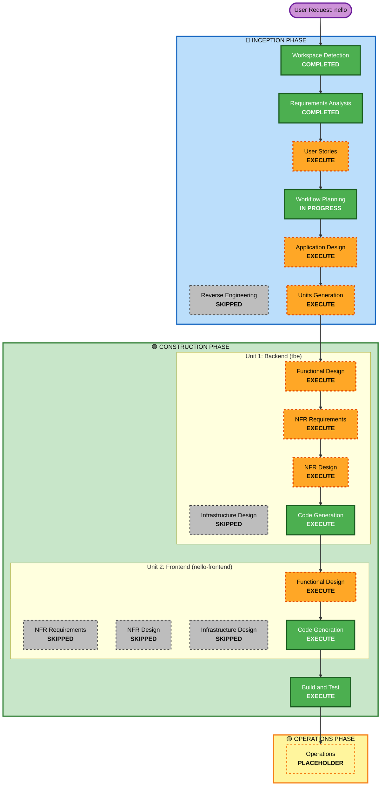

# Execution Plan — nello

## Intent Analysis Summary
- **Request**: Build "nello" Trello-clone (React + Java Spring Boot)
- **Type**: Greenfield, New Project
- **Complexity**: Moderate-Complex
- **Risk Level**: Medium (WebSocket, magic-link auth, multi-user real-time)

## Change Impact Assessment
- **User-facing changes**: Yes — full new UI (boards, lists, cards, drag-and-drop)
- **Structural changes**: Yes — new full-stack system
- **Data model changes**: Yes — new schema (users, boards, lists, cards, tokens, audit)
- **API changes**: Yes — new REST + WebSocket endpoints
- **NFR impact**: Yes — real-time WebSocket, magic-link auth, Hibernate Envers audit

## Risk Assessment
- **Risk Level**: Medium
- **Rollback Complexity**: Easy (greenfield, no existing system)
- **Testing Complexity**: Moderate (WebSocket, token expiry, DnD)

---

## Workflow Visualization

---

## Phases to Execute

### 🔵 INCEPTION PHASE
- [x] Workspace Detection — COMPLETED
- [x] Reverse Engineering — SKIPPED (Greenfield)
- [x] Requirements Analysis — COMPLETED
- [ ] User Stories — **EXECUTE**
  - *Rationale*: Multiple user personas (board owner, collaborator), user-facing features, acceptance criteria valuable
- [x] Workflow Planning — IN PROGRESS
- [ ] Application Design — **EXECUTE**
  - *Rationale*: New components, REST API + WebSocket design, service layer, magic-link auth flow
- [ ] Units Generation — **EXECUTE**
  - *Rationale*: Two separate packages (backend tbe + frontend nello-frontend) with clear boundaries

### 🟢 CONSTRUCTION PHASE — Unit 1: Backend (tbe)
- [ ] Functional Design — **EXECUTE**
  - *Rationale*: Complex data model (users, boards, lists, cards, tokens, audit), business rules (token expiry, domain validation, permissions)
- [ ] NFR Requirements — **EXECUTE**
  - *Rationale*: Real-time WebSocket, magic-link auth, Hibernate Envers audit — all require NFR design
- [ ] NFR Design — **EXECUTE**
  - *Rationale*: Follows from NFR Requirements
- [ ] Infrastructure Design — **SKIP**
  - *Rationale*: SQLite local file, no cloud/container infrastructure
- [ ] Code Generation — **EXECUTE** (ALWAYS)

### 🟢 CONSTRUCTION PHASE — Unit 2: Frontend (nello-frontend)
- [ ] Functional Design — **EXECUTE**
  - *Rationale*: Component hierarchy, state management, WebSocket integration, DnD interaction design
- [ ] NFR Requirements — **SKIP**
  - *Rationale*: Frontend NFRs (performance, bundle size) are standard Vite defaults; no special requirements
- [ ] NFR Design — **SKIP**
  - *Rationale*: Follows from NFR Requirements skip
- [ ] Infrastructure Design — **SKIP**
  - *Rationale*: Static build served locally / dev server; no deployment infrastructure
- [ ] Code Generation — **EXECUTE** (ALWAYS)

### 🟢 CONSTRUCTION PHASE
- [ ] Build and Test — **EXECUTE** (ALWAYS)

### 🟡 OPERATIONS PHASE
- [ ] Operations — PLACEHOLDER

---

## Two-Unit Summary

| Unit | Location | Tech |
|------|----------|------|
| tbe (backend) | `apps/tbe/` | Java 25, Spring Boot, Hibernate 7.4, SQLite, Liquibase, Maven |
| nello-frontend | `apps/nello-frontend/` | Vite, React, TypeScript, @dnd-kit |

## Success Criteria
- Users can log in via email magic link (no password)
- Email domain validated against `allowed_email_domains_list`
- Users can create/share boards, manage lists and cards
- Drag-and-drop reorder and move cards in real-time across all connected users
- All actions audited in DB via Hibernate Envers
